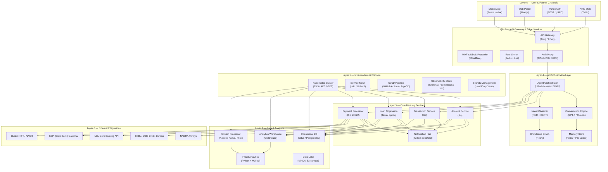
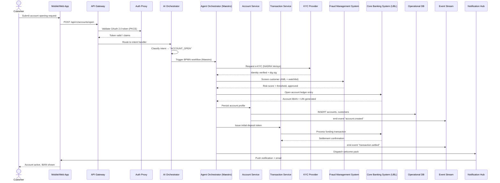

# SmartBank — Agentic AI Banking Operations Platform

> **Event:** UiPath AgentHack (Track 2 — Maestro BPMN) & UBL FinTech Hackathon
> **Phase:** 01 — Product Architecture — Enterprise-Grade Platform Design
> **Version:** 1.0.0

---

## Table of Contents

1. [Layered Architecture Diagram](#1-layered-architecture-diagram)
2. [Component Responsibilities](#2-component-responsibilities)
3. [Data Flow](#3-data-flow)
4. [Security Framework](#4-security-framework)
5. [Scalability Strategy](#5-scalability-strategy)
6. [Tech Stack](#6-tech-stack)

---

## 1. Layered Architecture Diagram



---

## 2. Component Responsibilities

| Component | Purpose | Inputs | Outputs | Owner Team | SLA |
|---|---|---|---|---|---|
| **Conversation Engine** | Multi-lingual NLU for customer interactions | Chat text, voice transcription | Intent + entities + sentiment score | AI/ML Team | < 800ms P95 |
| **Intent Classifier** | NER + BERT-based intent routing | User utterance, context history | Classified intent label, confidence | AI/ML Team | < 400ms P95 |
| **Agent Orchestrator** | BPMN workflow execution via UiPath Maestro | Business event, customer context | Completed task, audit trail | Automation Team | < 2s P99 end-to-end |
| **Knowledge Graph** | Relationship mapping for customers, accounts, fraud rings | Entity extraction output | Graph traversal results, risk scores | Data Engineering | < 1s P95 query |
| **Account Service** | Customer account CRUD, balance inquiry, profile management | Customer ID, auth token | Account payload, ledger entry | Backend Team | < 200ms P95 |
| **Transaction Service** | Funds transfer, bill pay, transaction history | Sender/recipient + amount + auth | Settlement receipt, journal entry | Backend Team | < 500ms P95 |
| **Loan Origination** | Apply, underwrite, disburse loans | KYC pack, credit score, amount | Loan schedule, disbursement TXN | Backend Team | < 3s P95 |
| **Payment Processor** | ISO 20022 message handling, clearing, settlement | Payment order (pain.001) | Status report (pacs.002, camt.056) | Payments Team | < 5s P95 end-to-end |
| **Stream Processor** | Real-time fraud detection, CEP, anomaly scoring | Transaction stream, session events | Alert, score, blocking signal | Data Engineering | < 100ms event-to-score |
| **Fraud Analytics** | ML model inference, feedback loop, retraining | Labeled TXN history, stream features | Model artifact, risk prediction | AI/ML Team | Batch daily / real-time < 50ms |
| **Notification Hub** | Multi-channel alerting (push, SMS, email) | Template ID, recipient, params | Delivery receipt, bounce stats | Backend Team | < 30s delivery |
| **API Gateway** | Auth, routing, rate limiting, request validation | HTTP/REST or gRPC call | Forwarded request, error response | Platform Team | < 10ms added latency |
| **Secrets Management** | Rotate keys, store credentials, audit access | Vault API call | Decrypted secret TTL-bound | Security Team | < 50ms read |
| **Observability Stack** | Metrics, logs, traces, dashboards, alerting | Instrumented telemetry | Dashboard, alert, trace waterfall | Platform Team | < 15s ingestion delay |

---

## 3. Data Flow

### 3.1 Customer Request → Resolution (Account Opening)



### 3.2 Step-by-Step Sequence

1. **Ingestion** — Request arrives via mobile, web, API, or IVR. API Gateway terminates TLS 1.3, validates JWT (OAuth 2.0 + PKCE), applies rate limits (100 req/s per tenant), and routes to the AI Orchestration Layer.

2. **Intent Classification** — The Conversation Engine parses the utterance, runs NER for entity extraction, and classifies the intent with a confidence score. Low-confidence (< 0.85) requests escalate to a human-in-the-loop fallback queue monitored by bank agents.

3. **BPMN Orchestration** — UiPath Maestro loads the appropriate BPMN definition (Account Opening, Fund Transfer, Loan Application, etc.) and begins executing the workflow. Each step (KYC, fraud check, credit bureau, ledger update) maps to a service task in the BPMN graph.

4. **Service Execution** — Core banking services (Account, Transaction, Loan, Payment) execute the atomic business operations. They write to the Operational DB (Citus/PostgreSQL) with read-after-write consistency and emit domain events to Apache Kafka.

5. **Real-time Fraud Screening** — The Stream Processor (Flink) consumes all transaction events with sub-100ms latency. It scores each event against a set of ML models (isolation forest, XGBoost, graph neural network). Suspicious events trigger a blocking signal back to the orchestrator before settlement.

6. **External Clearing** — For inter-bank transactions, the Payment Processor formats ISO 20022 messages (pain.001, pacs.008), submits via SBP/1Link gateway, and processes the callback (pacs.002, camt.056) to update the transaction status.

7. **Notification & Resolution** — Upon successful completion, the Agent Orchestrator emits a completion event. The Notification Hub delivers the outcome to the customer via push, SMS, and email. All events are logged to the Data Lake (MinIO) for audit and regulatory compliance.

---

## 4. Security Framework

### 4.1 Authentication & Authorization

| Layer | Mechanism | Detail |
|---|---|---|
| **Customer Auth** | OAuth 2.0 + PKCE | Authorization code flow with Proof Key for Code Exchange. Refresh tokens rotated every 15 minutes. No client secret stored on device. |
| **Partner Auth** | mTLS + OAuth 2.0 Client Credentials | Mutual TLS with pinned certificates. JWT scoped per API product with 5-minute TTL. |
| **Internal Service Auth** | SPIFFE / SPIRE | Workload identity via X.509 SVIDs in Istio service mesh. Automatic rotation every 6 hours. |

### 4.2 Encryption

| Scope | Algorithm | Key Management |
|---|---|---|
| **Data at Rest (DB)** | AES-256-GCM | Per-table encryption keys stored in HashiCorp Vault, rotated daily. |
| **Data at Rest (Object Store)** | AES-256-SSE | MinIO server-side encryption with KMS-managed CMK. |
| **Data in Transit** | TLS 1.3 | All internal and external traffic. Cipher suite: `TLS_AES_256_GCM_SHA384`. HSTS enabled. |
| **Application-Level PII** | Field-level encryption | Sensitive fields (CNIC, phone, DOB) encrypted with envelope encryption using Google Tink. |

### 4.3 Compliance & Regulatory

- **PCI-DSS v4.0** — Card data never touches application servers. All payment tokens handled via PCI-certified token vault. Audit logging covers all cardholder data environment (CDE) access.
- **SBP (State Bank of Pakistan) Regulations** — Transaction reporting in real-time via SBP gateway. Anti-money laundering (AML) screening against UNSC sanctions list. Mandatory 5-year data retention in immutable data lake.
- **PSD2 / Open Banking** — Strong Customer Authentication (SCA) via biometric + OTP. Consent management with revocation API. Third-party access logs available to customer.
- **Data Privacy** — GDPR / PDPA compliance: right to erasure, data portability API, anonymization of analytical datasets.

### 4.4 Operational Security

- **Secret Rotation** — All secrets (DB passwords, API keys, JWT signing keys) rotated automatically every 90 days. Vault agents restart services with zero downtime on rotation.
- **Fraud Hooks** — Every transaction passes through a pre-settlement fraud hook pipeline. Hooks are dynamically loaded as WebAssembly modules and scored. Hooks with aggregate score > threshold trigger immediate freeze + alert.
- **Audit Trail** — Immutable, append-only audit log stored in Kafka + MinIO Data Lake. Each entry includes event ID, timestamp, actor, action, resource, outcome, and cryptographic hash link to previous entry.
- **WAF & DDoS** — Cloudflare WAF with OWASP Core Rule Set. Rate limiting per IP, per user, and per endpoint. DDoS mitigation with auto-scaling scrubbers.

---

## 5. Scalability Strategy

### 5.1 Horizontal Pod Autoscaling (HPA)

```yaml
apiVersion: autoscaling/v2
kind: HorizontalPodAutoscaler
metadata:
  name: account-service-hpa
spec:
  scaleTargetRef:
    apiVersion: apps/v1
    kind: Deployment
    name: account-service
  minReplicas: 3
  maxReplicas: 50
  metrics:
    - type: Resource
      resource:
        name: cpu
        target:
          type: Utilization
          averageUtilization: 70
    - type: Resource
      resource:
        name: memory
        target:
          type: Utilization
          averageUtilization: 80
    - type: Pods
      pods:
        metric:
          name: requests_in_flight
        target:
          type: AverageValue
          averageValue: 500
```

### 5.2 Asynchronous Messaging & Queuing

| Queue | Purpose | Consumer | DLQ Strategy | Max Retries |
|---|---|---|---|---|
| `txn.processing` | Payment/transfer orders | Transaction Service | DLQ after 3 retries, TTL 7 days | 3 |
| `kyc.evaluation` | KYC document verification | KYC Provider Adapter | DLQ + manual review queue | 2 |
| `notification.dispatch` | Outbound push/SMS/email | Notification Hub | DLQ with exponential backoff | 5 |
| `fraud.scoring` | Real-time anomaly detection | Fraud Analytics Engine | DLQ + alert security team | 1 |

### 5.3 Multi-Region Failover

| Region | Role | Replication |
|---|---|---|
| **ap-south-1 (Primary)** | Active — all workloads | — |
| **me-south-1 (Standby)** | Warm standby — read replicas, stateless workloads | Synchronous DB replication (Citus), async Kafka MirrorMaker |
| **eu-west-1 (DR)** | Cold — infrastructure provisioned, data synced daily | Periodic snapshots to S3 cross-region replication |

- **RTO (Recovery Time Objective):** < 5 minutes for critical path (account, transaction, payment).
- **RPO (Recovery Point Objective):** < 1 second via synchronous replication within region; < 5 minutes cross-region.
- **Failover Mechanism:** Route53 health checks with automatic failover. Istio locality-aware load balancing drains traffic from degraded region within 30 seconds.

### 5.4 Performance Guarantees

| Metric | Target | Measurement |
|---|---|---|
| **API P99 Latency** | < 2 seconds end-to-end | Synthetic monitoring every 30 seconds from 3 regions |
| **Availability** | 99.95% uptime (monthly) | SLI: successful requests / total requests |
| **Throughput** | 10,000 TPS per service | Load tested at 2x expected peak |
| **Cache Hit Ratio** | > 90% (Redis) | Redis INFO command, Grafana dashboard |
| **Queue Depth** | < 1,000 messages steady state | Kafka consumer lag monitoring |

---

## 6. Tech Stack

| Component | Technology | Justification | License |
|---|---|---|---|
| **API Gateway** | Kong Gateway (Enterprise) | Native OAuth 2.0, rate limiting, plugin ecosystem, gRPC transcoding | Apache 2.0 / Business Source |
| **WAF / CDN** | Cloudflare | Global edge network, DDoS mitigation, SSL termination, bot management | Proprietary |
| **AI Orchestration** | UiPath Maestro BPMN | Track 2 requirement, native BPMN 2.0 runtime, event-driven workflow | Proprietary |
| **Conversation Engine** | GPT-4 / Claude 3.5 | State-of-the-art NLU, multi-lingual support (Urdu, English), function calling | Proprietary API |
| **Intent Classifier** | BERT (fine-tuned) + spaCy | On-premise inference for low latency, no data exfiltration | MIT |
| **Knowledge Graph** | Neo4j AuraDB | Native graph traversal for fraud ring detection, account linkage | GPL v3 / Commercial |
| **Vector Store** | pgvector (PostgreSQL extension) | Coupled with operational DB, no additional infrastructure, ACID compliance | PostgreSQL license |
| **Cache** | Redis Enterprise (or Valkey) | Sub-millisecond reads, rate limiting, session store | Redis: RSAL / Valkey: BSD-3 |
| **Operational DB** | Citus (PostgreSQL sharding) | Distributed SQL, horizontal sharding, JSONB for flexible schemas, PostGIS for geospatial | AGPL v3 / Apache 2.0 |
| **Analytics** | ClickHouse | Columnar OLAP, sub-second queries on billion-row datasets, materialized views | Apache 2.0 |
| **Stream Processing** | Apache Kafka + Flink | Event sourcing, exactly-once semantics, CEP patterns, stateful processing | Apache 2.0 |
| **Fraud ML** | Python + MLflow + XGBoost | Python ecosystem for data science, MLflow for experiment tracking and model registry | BSD-3 / Apache 2.0 |
| **Container Orchestration** | Kubernetes (EKS) | Industry standard, HPA, service mesh integration, multi-region | Apache 2.0 |
| **Service Mesh** | Istio | mTLS, traffic splitting, circuit breaking, observability | Apache 2.0 |
| **CI/CD** | GitHub Actions + ArgoCD | GitOps workflow, PR-based deployments, automated rollback | MIT / Apache 2.0 |
| **Secrets** | HashiCorp Vault | Dynamic secrets, encryption-as-a-service, audit logging | MPL 2.0 / Business Source |
| **Observability** | Grafana + Prometheus + Loki + Tempo | Metrics (Prom), logs (Loki), traces (Tempo), unified dashboards (Grafana) | AGPL v3 / Apache 2.0 |
| **Data Lake** | MinIO (S3-compatible) | On-premise S3 API, immutable buckets, versioning, WORM compliance | AGPL v3 / Commercial |
| **Notification** | Twilio + SendGrid | SMS (Twilio), email (SendGrid), WhatsApp Business API | Proprietary |
| **Mobile** | React Native | Cross-platform, hot reload, large community, shared TypeScript types | MIT |
| **Web Portal** | Next.js + TailwindCSS | SSR, ISR, App Router, server components, optimized Core Web Vitals | MIT |
| **Payments (ISO 20022)** | Apache Fineract + custom adapter | Open-source core banking, ISO 20022 message parsing, configurable ledger | Apache 2.0 |
| **SBP Gateway** | Custom Go adapter | High-throughput, low-latency SBP API client with retry and circuit breaker | Proprietary (SmartBank) |

---

*This document is part of SmartBank's Phase 01 submission for the UiPath AgentHack (Track 2 — Maestro BPMN) and UBL FinTech Hackathon. For questions, contact the architecture team.*
