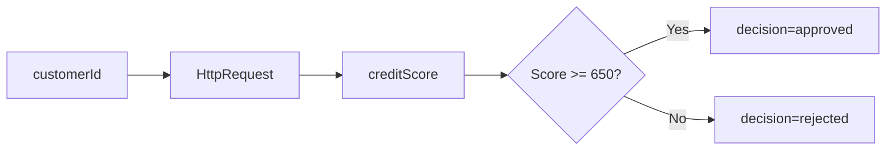

# Coding Agent Scenario Prompts — SmartBank

> Master meta-prompt document for 5 Coding Agent scenarios.
> Each scenario includes input format, processing instructions, output expectations, and quality gates.

---

## Scenario 1 — Auto-Generate UiPath Sequences from BPMN

### Purpose
Convert BPMN 2.0 XML into a fully functional UiPath XAML workflow sequence.

### Input Format
```xml
<!-- Provide the BPMN XML snippet with embedded activities -->
<bpmn:definitions xmlns:bpmn="http://www.omg.org/spec/BPMN/20100524/MODEL">
  <bpmn:process id="Process_1" isExecutable="true">
    <bpmn:startEvent id="StartEvent_1" />
    <bpmn:serviceTask id="Task_CreditCheck" name="Credit Check" />
    <bpmn:exclusiveGateway id="Gateway_Decision" />
    <bpmn:endEvent id="EndEvent_1" />
    <!-- ... connectors, lanes, etc. -->
  </bpmn:process>
</bpmn:definitions>
```

Plus a **configuration block** with:
- Target UiPath project name
- Activity configuration overrides (e.g. timeout, retry count)
- Variable naming convention (camelCase / PascalCase)

### Processing Instructions
1. Parse BPMN elements — map each `bpmn:serviceTask`, `bpmn:userTask`, `bpmn:scriptTask` to a UiPath activity.
2. Convert gateways → `If` / `Switch` / `FlowDecision` blocks.
3. Preserve sequence flow order as the XAML sequence order.
4. Insert error handlers (`Try Catch` / `Rethrow`) around every HTTP/DB activity.
5. Declare variables typed from BPMN `dataInput` / `dataOutput` associations.
6. Embed XML namespace using `http://schemas.uipath.com/workflow/activities`.

### Output Format
```xml
<Activity mc:Ignorable="sap" ... x:Class="CreditCheckProcess">
  <Sequence sap:VirtualizedContainerService.HintSize="..." sap2010:WorkflowViewState.IdRef="...">
    <Sequence.Variables>
      <Variable x:TypeArguments="x:String" Name="customerId" />
      <Variable x:TypeArguments="x:Int32" Name="creditScore" />
    </Sequence.Variables>
    <TryCatch DisplayName="Credit Check">
      <Try>
        <HttpClient ... Url="[apiEndpoint]" />
      </Try>
      <Catches>
        <Catch x:TypeArguments="s:Exception">
          <LogMessage Message="[Exception.Message]" />
          <Rethrow />
        </Catch>
      </Catches>
    </TryCatch>
    <If Condition="[creditScore >= 650]">
      <Then>
        <LogMessage Level="Info" Message="Approved" />
      </Then>
      <Else>
        <LogMessage Level="Warn" Message="Rejected" />
      </Else>
    </If>
  </Sequence>
</Activity>
```

### Quality Gates
- [ ] XAML parses without error in UiPath Studio (validate with `Uipath.PackageValidator`)
- [ ] Every service task wrapped in `TryCatch`
- [ ] Variable names match naming convention
- [ ] No hardcoded credentials (use `SecureString` / `orchestrator` assets)
- [ ] XAML contains `sap:VirtualizedContainerService.HintSize` for all containers

---

## Scenario 2 — API Connector Scaffolding

### Purpose
Generate a UiPath HTTP Request configuration and supporting files from an OpenAPI 3.0 YAML spec.

### Input Format
```yaml
openapi: 3.0.3
info:
  title: SmartBank Credit Decision API
  version: 1.0.0
paths:
  /credit/check:
    post:
      summary: Submit credit check request
      requestBody:
        required: true
        content:
          application/json:
            schema:
              type: object
              properties:
                customerId:
                  type: string
                income:
                  type: number
      responses:
        '200':
          description: Credit decision response
```

### Processing Instructions
1. Extract `servers[0].url` → set as base URL in `HttpClient` activity.
2. For each `post` / `put` path → generate JSON body from `requestBody` schema.
3. For `get` / `delete` paths → convert `parameters` to query string.
4. **Authentication**: detect `components.securitySchemes[].type`:
   - `http` (Bearer) → set Bearer token from `orchestrator` asset.
   - `apiKey` → inject header from `orchestrator` asset.
   - `oauth2` → add `OAuth2` step retrieving token before request.
5. Wrap each call in `TryCatch` + `LogMessage` + `Throw`.
6. Generate **test stubs** (separate test workflow) that mock responses from `responses` examples.

### Output Format

**Main workflow** (XAML):
```xml
<HttpClient Method="POST" Uri="[baseUrl]/credit/check">
  <HttpClient.Headers>
    <HttpRequestHeader Name="Authorization" Value="Bearer [token]" />
    <HttpRequestHeader Name="Content-Type" Value="application/json" />
  </HttpClient.Headers>
  <HttpClient.Body>
    <InlineJson>{"customerId": customerId, "income": income}</InlineJson>
  </HttpClient.Body>
</HttpClient>
```

**Test stub** (XAML – separate file):
```xml
<HttpMockResponse UrlPattern="*/credit/check" StatusCode="200">
  <HttpMockResponse.Body>
    <InlineJson>{"decision": "approved", "score": 720}</InlineJson>
  </HttpMockResponse.Body>
</HttpMockResponse>
```

### Quality Gates
- [ ] Url matches `servers[0].url` — no copy-paste overrides
- [ ] All security schemes mapped to UiPath credential assets
- [ ] Every path generates at least one test stub
- [ ] Required `requestBody` fields produce non-null defaults in stub data
- [ ] `Activity` XML namespaces fully qualified

---

## Scenario 3 — Test Script Generation

### Purpose
Generate a UiPath Test Suite `.json` file containing 20 test cases from a textual workflow description.

### Input Format
```
Workflow Name: CreditDecisionWorkflow
Description: Accepts customer ID and income; calls Credit Decision API;
  if score >= 650 returns "approved" else "rejected"; logs all decisions.
Inputs: customerId (String), income (Double)
Outputs: decision (String), score (Int32)
```

### Processing Instructions
1. Parse input/output definitions → typed test arguments.
2. Generate **20 test cases**:
   - 7 **boundary** tests (score = 649, 650, 651, income = 0, max allowed, min allowed, empty customer ID)
   - 7 **negative** tests (negative income, null customerId, API timeout, 5xx response, malformed JSON, missing field, auth failure)
   - 3 **performance** tests (response time < 2s, < 5s, < 10s)
   - 3 **regression** tests (idempotent call, repeated call returns same decision, concurrent calls)
3. For each test case define:
   - `testCase.id` — DSC-{NNN}
   - `testCase.name` — descriptive title
   - `testCase.inputValues` — map parameter → value
   - `testCase.expectedOutput` — expected result (exact or regex)
   - `testCase.tags` — ["boundary", "negative", "performance", "regression"]
4. Compute **expected coverage** — every branch of every gateway must be hit.

### Output Format
```json
{
  "testSuite": {
    "id": "TS-CREDIT-DECISION-001",
    "name": "Credit Decision Workflow Tests",
    "testCases": [
      {
        "id": "DSC-001",
        "name": "Boundary: score 649 should be rejected",
        "inputValues": {
          "customerId": "CUST-001",
          "income": 50000.0
        },
        "mockedApiResponses": {
          "decision": "rejected",
          "score": 649
        },
        "expectedOutput": {
          "decision": "rejected"
        },
        "tags": ["boundary"]
      }
    ]
  }
}
```

### Quality Gates
- [ ] Exactly 20 test cases present
- [ ] All tags (`boundary`, `negative`, `performance`, `regression`) present at least once
- [ ] Every `expectedOutput` includes at minimum `decision`
- [ ] No test case duplicates by `id`
- [ ] Coverage map demonstrates all gateway branches exercised

---

## Scenario 4 — Documentation Generation

### Purpose
Generate human-readable Markdown documentation from a UiPath XAML workflow file.

### Input Format
```xml
<!-- Provide the full XAML file content -->
<Activity mc:Ignorable="sap" ...>
  <!-- XAML content -->
</Activity>
```

### Processing Instructions
1. Parse XAML activity tree; extract `DisplayName` and `TypeName` for each activity.
2. Build nested activity tree — 2-space indent per nesting level.
3. Extract `<Variable>` declarations → build variable glossary (Name, Type, Default, Usage).
4. Identify **externally visible** dependencies:
   - Orchestrator assets (look for `assetName` attributes)
   - HTTP endpoints (look for `Uri` attributes)
   - Queue names (look for `QueueName` attributes)
5. Document known limitations:
   - Hardcoded delays (`Delay` activity > 5s)
   - Missing error handlers (activities without `TryCatch` ancestor)
   - Unused variables
6. Generate **data flow diagram** in Mermaid.js format.

### Output Format
```markdown
# Workflow: Credit Decision

## Activity Tree
```
Sequence "Credit Decision Flow"
  TryCatch "Main Handler"
    Try
      HttpRequest "Call Credit API"
      If "Score >= 650?"
        Then
          LogMessage "Approved"
        Else
          LogMessage "Rejected"
    Catches
      Catch "Exception"
        LogMessage "Error"
        Rethrow
```

## Variable Glossary
| Name       | Type     | Default   | Used In                     |
|------------|----------|-----------|-----------------------------|
| customerId | String   | null      | HttpRequest, LogMessage     |
| creditScore| Int32    | 0         | If condition, LogMessage    |

## Dependencies
- Orchestrator Asset: `CreditApiToken` (String)
- HTTP Endpoint: `https://api.smartbank.com/v1/credit`

## Known Limitations
- No error handler inside "Log Decision" branch
- `Delay` activity (30s) in approval branch — consider async pattern

## Data Flow (Mermaid)

```

### Quality Gates
- [ ] Every activity in XAML appears in activity tree
- [ ] Every variable declared appears in glossary
- [ ] Dependencies section lists at most 3 unknown/unresolved references
- [ ] Known limitations lists at least 2 meaningful findings
- [ ] Mermaid diagram renders correctly (test with `mmdc` CLI)

---

## Scenario 5 — Workflow Issue Analysis

### Purpose
Analyze an error log and associated XAML to produce root-cause analysis and patched workflow.

### Input Format
Provide:
1. **Error log** (UiPath execution log snippet):
```
2026-06-20 10:15:23.456 ERROR  CreditDecision  System.NullReferenceException:
  Object reference not set to an instance of an object.
  at InvokeCodeMethod(..) in CreditCheck.xaml:45
```
2. **XAML file content** — the full workflow that produced the error.

### Processing Instructions
1. Parse error log for exception type, message, line number, activity name.
2. Match line number to XAML element (search for `sap:WorkflowViewState.IdRef` or inline location).
3. Identify likely root cause:
   - Null variable → trace variable initialization and assignment path.
   - Uninitialized argument → check `x:TypeArguments` vs actual assignment.
   - Missing error handler → check `TryCatch` ancestry.
4. Generate **patched XAML** — minimal diff that fixes the issue.
5. Generate **regression test** — a test case that would have caught the error.
6. Suggest **monitoring** — add `LogMessage` before the offending activity to track state.

### Output Format
```markdown
## Root-Cause Analysis

### Error Summary
- **Exception**: NullReferenceException
- **Location**: CreditCheck.xaml:45 — `Assign` activity "Set customer object"
- **Timestamp**: 2026-06-20 10:15:23.456

### Root Cause
Variable `customer` (type `SmartBank.Models.Customer`) is declared but never
assigned when the API returns HTTP 404. Line 44 receives JSON, line 45 attempts
`customer.Name` on a null reference.

### Fix
Initialize `customer` with a default empty instance before the API call, and
add a gateway to check API response status before deserialization.

### Patched XAML (diff)
```xml
- <Assign DisplayName="Set customer object">
-   customer = JsonConvert.DeserializeObject(apiResponse)
- </Assign>
+ <If Condition="[apiStatusCode = 200]">
+   <Then>
+     <Assign DisplayName="Set customer object">
+       customer = JsonConvert.DeserializeObject(apiResponse)
+     </Assign>
+   </Then>
+   <Else>
+     <Assign DisplayName="Set default customer">
+       customer = New Customer()
+     </Assign>
+   </Else>
+ </If>
```

### Regression Test
```json
{
  "id": "DSC-REG-001",
  "name": "Regression: API 404 should not cause NullReferenceException",
  "mockedApiResponses": { "status": 404, "body": null },
  "expectedOutput": { "exception": null, "decision": "error" }
}
```

### Monitoring Recommendation
Add before line 45:
```xml
<LogMessage Level="Trace" Message="[apiStatusCode + ': ' + apiResponse]" />
```
```

### Quality Gates
- [ ] Root cause clearly identifies the variable or code path at fault
- [ ] Patched XAML is minimal (no cosmetic changes)
- [ ] Regression test would fail against original XAML, pass against patched XAML
- [ ] Monitoring recommendation includes specific variable to log
- [ ] Diff is executable — applying it to original XAML produces valid XAML

---

## Common Processing Rules (All Scenarios)

1. **Placeholders**: Use square bracket notation `[placeholderName]` for dynamic values.
2. **Secrets**: Never embed credentials inline; reference `orchestrator` assets.
3. **Validation**: All generated XAML must start with `<Activity` and end with `</Activity>`.
4. **Formatting**: Indent with 2 spaces; keep lines under 200 characters.
5. **Fallback**: If input is malformed, return `{"error": "description", "hint": "fix"}` instead of crashing.

## Agent Output Manifest

Every Coding Agent response must include a trailing manifest block:

```json
{
  "_manifest": {
    "scenario": "1 | 2 | 3 | 4 | 5",
    "inputSizeBytes": 1234,
    "outputSizeBytes": 5678,
    "generatedFiles": ["CreditCheck.xaml", "test-suite.json"],
    "qualityGates": { "passed": 6, "total": 6 },
    "model": "opencode/big-pickle",
    "timestamp": "2026-06-20T12:00:00Z"
  }
}
```
